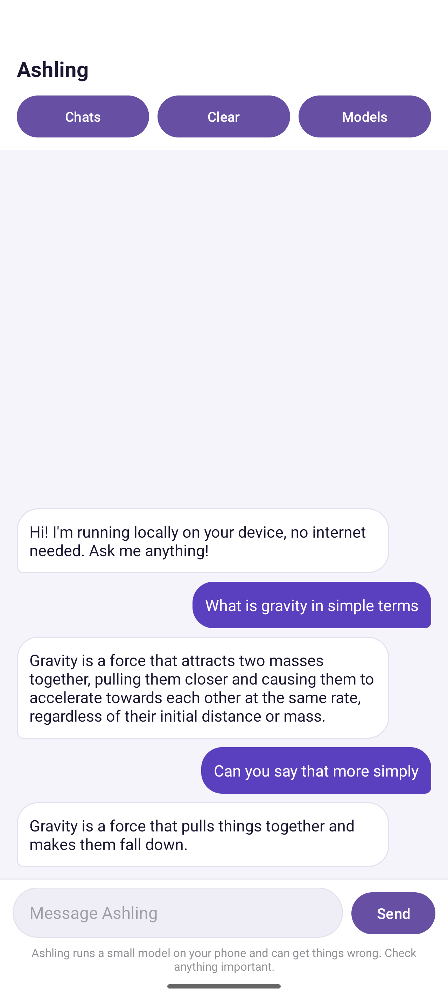

# Ashling

An Android chat app that runs a language model on the phone itself. Once the
model file is downloaded there is no internet involved. Nothing is sent to a
server, and it works in aeroplane mode.

"Ashling" is the Irish word for light.



There is an iPhone version too:
[Harshal-Abdulla/ashling-ios](https://github.com/Harshal-Abdulla/ashling-ios). It
has no download link, because iOS will not install an app from a website. You
build it in Xcode and run it on your own device.

## Download

Grab the APK from the [Releases page](https://github.com/Harshal-Abdulla/ashling-android/releases).

Android will warn you about installing outside the Play Store. That is expected
for a sideloaded app, so you have to allow "install unknown apps" for whatever
browser or file manager you used.

Needs Android 8.0 or newer, on a 64-bit phone. That is anything made since
about 2015. The APK only carries arm64 libraries, because shipping the 32-bit
and x86 ones as well took it from 32MB to 110MB for architectures almost nobody
runs.

## Getting a model

The app does not ship with a model, because they are too big to put in an APK.
You pick one on the Switch Model screen and it downloads there.

Five of them need no account at all. Qwen 2.5 is the one to get. The smaller
ones answer, but roughly. SmolLM is there for checking the app works on a phone
that cannot hold anything bigger.

| Model | Size | Needs |
|---|---|---|
| Qwen 2.5 1.5B (recommended) | 1.5 GB | 4 GB RAM |
| SmolLM 135M | 160 MB | any phone, rough answers |
| TinyLlama 1.1B | 1.1 GB | 3 GB RAM |
| DeepSeek R1 1.5B | 1.8 GB | 4 GB RAM |
| Phi-4 Mini 3.8B | 3.8 GB | 8 GB RAM, recent flagship |

Four Gemma models are also there, but Google puts those behind Kaggle, so they
need a free Kaggle account and an API token:

1. Sign in at [kaggle.com](https://www.kaggle.com) and go to Settings
2. Under API, click "Create New Token", which downloads a `kaggle.json` file
3. Open that file to get your username and key
4. Accept the [Gemma terms](https://ai.google.dev/gemma/terms) on the model page
5. Enter them in the app when it asks

## What it does

- Chats are saved. Open the Chats panel to switch between them, start a new one
  or delete one. Everything is stored in the app's own folder on the phone and
  never leaves it.
- Reopening the app puts you back in the last chat you were in.
- Remembers the conversation, so follow-up questions work.
- Nine models to choose from, five of which need no account.
- Each model family gets the prompt format it was trained on. Feeding a Qwen
  model a Gemma-shaped prompt is what produced most of the early gibberish.
- The whole answer appears at once rather than word by word. Streaming looked
  better, but the streaming API never reported that it had finished for most of
  these models, which left the app stuck and unable to send anything else.
- Warns you on first launch that a small model gets things wrong.

## Building it yourself

```
git clone https://github.com/Harshal-Abdulla/ashling-android.git
cd ashling-android
./gradlew assembleDebug
```

The APK ends up in `app/build/outputs/apk/debug/`.

Do not keep the project in Desktop or Documents if iCloud Drive is syncing
them. iCloud makes "file 2.xml" copies inside `app/build`, and the dex step
fails on the duplicates. Somewhere like `~/Projects` avoids it.

You need JDK 21. JDK 25 does not work with this version of the Android Gradle
plugin, and neither does Gradle 9. The wrapper pins Gradle 8.13, so that part
is handled for you.

For a release build you need a `keystore.properties` in the project root
pointing at your own signing key. It is gitignored, so without it the release
build is just unsigned rather than broken.

## Built with

| | |
|---|---|
| Kotlin | the app |
| MediaPipe Tasks GenAI 0.10.35 | running the model on-device |
| View binding, RecyclerView, Material 3 | the UI |

## Known problems

- Only the last ten messages are sent to the model. These have small context
  windows, and a long chat pushed the actual question out of view. Asking
  something in a fresh chat gave a sensible answer, while the same question
  after a dozen turns just got the earlier rambling back.

- No word by word streaming. generateResponseAsync looks better but never
  reported completion for most of these models, so the engine stayed busy and
  the next message came back with "Previous invocation still processing". The
  synchronous call always returns, so the app is reliable instead of pretty.

- Only the Gemma models need a Kaggle account, but that flow is still clumsy if
  you want one.
- Phi-4 Mini is as large as this can go. The bigger models on Hugging Face ship
  as `.litertlm` files, which this runtime does not read, so going further would
  mean moving to LiteRT-LM.
- Generation is slow on older phones. A 2B model is a lot to ask of a mid-range
  device, and the first reply after opening the app is the slowest.
- No way to delete a downloaded model from inside the app yet. You have to
  clear the app's storage in Android settings.

## Why I built it

I wanted to learn Kotlin properly, and running a model on-device seemed a more
interesting way to do that than another to-do list. The privacy side is a real
benefit too, since nothing typed into it leaves the phone.
